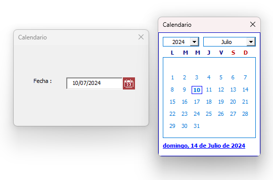

# Calendario



Descarga el libro **calendar.xlsm** y ortorga los permisos para ejecutar las macros, no necesitas activar ninguna referencia para usar el calendario. Este calendario esta desarrollado como una opción para la versiones que no cuentan con el **control calendario**.

## Recibir la fecha

Asigna la fecha, dentro del evento `click` que llamará al calendario, usa la siguiente instrucción para hacerlo `Set ctrlFecha = Me.[TextBox | Label | ComboBox ]` cualquier objeto que pueda recibir el valor.

## Ejemplo

Aquí se muestra creación de la instancia `ctrlFecha` dentro del **evento click** de un control `Label`. No necesitas hacer nada mas eso es todo.

```vb
Private Sub lblCalendar_Click()

    'Reemplazar por el control que recibirá la fecha,
    'esto debe hacerse antes que se muestre el calendario.
    Set ctrlFecha = Me.txtDate
    frmCalendar.Show

End Sub
```
