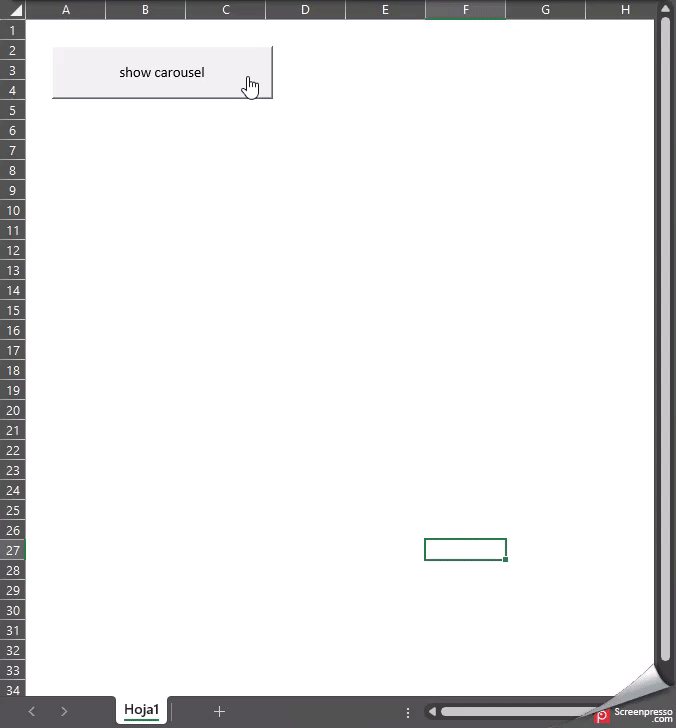

# Carrusel con VBA

## Instalación

- Descarga esta carpeta.

>[NOTE]
> Las imagenes estan dentro de la carpeta .\img\

## Activa la siguiente referencia

Presiona `Alt` + `F11` para abrir el **VBE**, luego Herramientas -> Referencias:

- Microsoft Scripting Runtime
