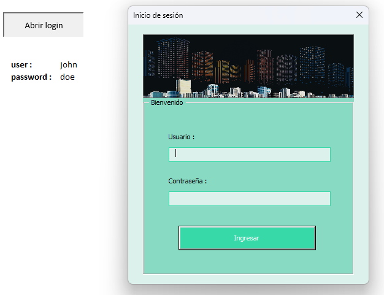

# Login

Descargue el libro **login.xlsm** y active los permisos para ejecutar las macros, no necesita ninguna biblioteca para usar este **Login**, solo debe modificar la lógica en la función `storage.validateLogin()` y reemplazar el formulario que se abrirá dentro de `Private Sub btnLogIn_Click()`.

## Usuario y password

- **usuario** : *jhon*
- **password** : *doe*